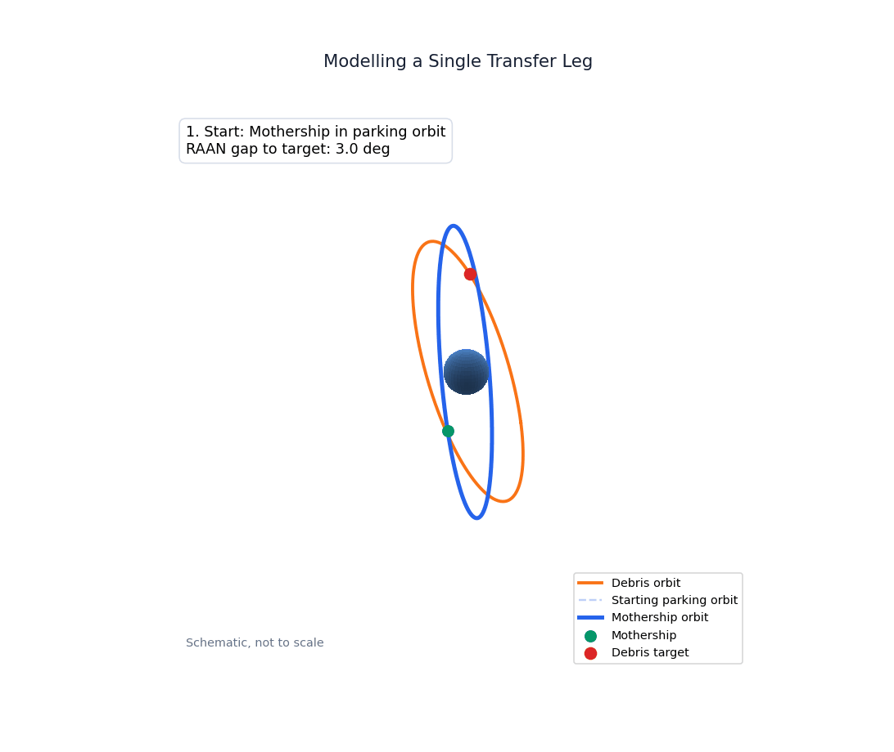

# j2-adr
J2 Perturbation for Active Debris Removal

Utilising Gauss' equations to align the orbit of a mothership-class spacecraft equipped with micro-satellites tasked with removing space debris from LEO in a SSO.

Orbital element data obtained from Space-Track.org, courtesy of the U.S. Space Surveillance Network and 18th Space Defense Squadron, USSPACECOM.

Claude utilised for QoL improvements in the repo and for actioning minor variable name changes etc.

## Visual Summary

This animation illustrates one transfer leg from the dissertation: the mothership enters a drift orbit, trims inclination, passively changes RAAN under J2, aligns its RAAN with the debris orbit, then returns to its parking-orbit shape.

[Watch the MP4 version](assets/j2-adr/06_single_leg_orbit_story.mp4)

